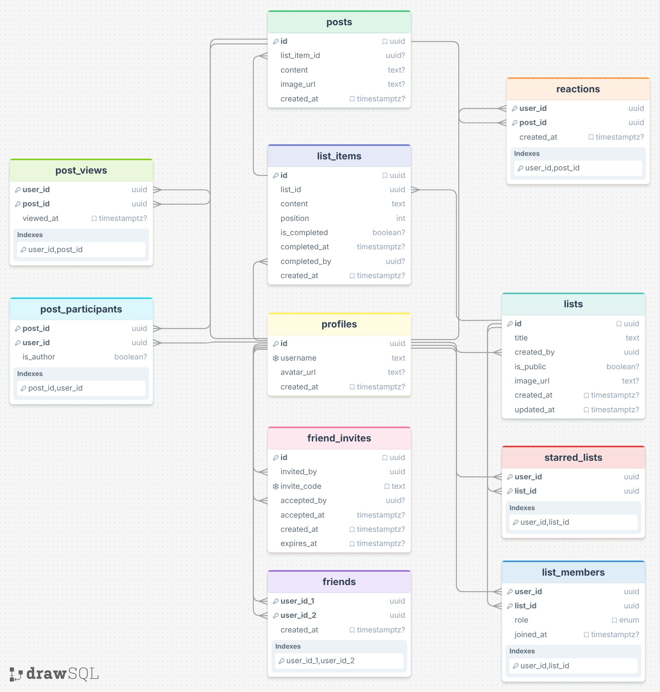

# Spark 🚀

[Work Log](log.md)

### Project Summary

Spark is a social media app combined with a bucket list app. Users can create bucket lists, check off items, collaborate with friends, and post their accomplishments as they complete items from their lists.

### Diagrams

ERD Diagram

Lists Screen (Home Screen)

List Detail Screen

Item Completion and Post Creation Modal

Feed Screen

Profile Screen

Friends Screen

Friend Invite Modal

### Demo Videos

Login and List Creation

Friend Invite with Account Creation

List Item Creation and Post Creation

Collaboration and Feed

#### Key Learnings

##### 1. Working with AI can significantly speed up the development process.

I tend to be a pretty independent person, and I like to do things on my own. However, in order to build what I had in mind for this project, I decided to lean on AI more and get a better feel for it (while still not giving it full control to build the whole thing). Throughout this project, I used AI to help build and troubleshoot my application, and I go into more detail on my AI use in the section below. As I used AI, I found that I was able to accomplish much more than I would have on my own in the same amount of time. For example, by using AI, I was able to create most of the CSS styling for my application in less than 5 hours. To create the same styles without AI's help would have taken me much longer—maybe two or three times as long, even. While the AI's CSS wasn't perfect, it gave me a much better starting point for tweaking and changing the app to match my ideas than if I had built all the CSS from scratch. (I still need to refine some of the CSS for the project, especially for mobile styling.) AI also helped to speed up database function creation and React component creation by helping me to avoid countless syntactical errors and helping me understand how to structure various components or functions.

##### 2. Supabase is magic. Except for free plan email limits.

Choosing to use Supabase is what really allowed me to build a fully working app within the assignment period. With Supabase, I really didn't build much of a backend for my project. The frontend React communicates with the database using database functions, which are protected by Supabase's built in row level security (RLS).

I used Supabase's database for my project data (profiles, lists, posts, etc.), Supabase's authentication for my project's authentication flow (logging in, signing up, signing out, etc.), and Supabase's storage for any images in my project (profile images, post images, list thumbnails). Using Supabase for all of these services greatly simplified the build of my app. Rather than focusing on authentication logic, hashing passwords, and securely storing user data, I was able to focus on actually building my application, since Supabase took care of the authentication and security out of the box. I plan to continue learning about and using Supabase in my own future projects.

The only thing that Supabase's free tier wasn't able to handle for my project's needs was registering various users in short periods of time. With Supabase's free tier, only two emails can be sent per hour (which I quickly discovered while I was testing my auth flow). I use just a username and a password for signing in to an existing account, but new accounts must confirm their email. With the Supabase free tier limits, I would only be able to have two people sign up for my app per hour (that hasn't been an issue with my current volume of users yet, but if my app grows at all, it will need to be able to handle more than two sign ups per hour). Since I'd like to see this app go a bit further than just myself and my small circle of friends, I decided that I needed a higher email limit, so I used the Resend email service combined with AWS to configure my own custom email service, which allows me to send 3000 emails per month (on the Resend free tier), which is more than enough for my application's current needs.

##### 3. Planning ahead and doing lots of upfront work makes things go much smoother down the road.

I brainstormed a lot of different ideas before settling on a social bucket list app. However, the idea for a social bucket list app actually came to me last semester, and some classmates and I designed UI for that app idea in a different class (CS 256). At the beginning of the project, I knew the big picture of what I wanted the app to do, so I took a lot of time to think about and plan exactly how that should be done. I mapped out the database schema over a couple of iterations to make sure I didn't miss anything, I redesigned my UI to better align with what I hoped the app would do and become, and I explored ways to build the things I wanted the app to do but was unsure of how exactly to implement. I didn't start writing any code or structuring the database until I was fairly confident in the plan I had.

After having a solid plan in place, I then began by creating all my database tables and then building each page and its associated database functionality piece by piece. Since I had figured out my plan for building the app beforehand, the process went very smoothly, and I saved a lot of time that otherwise would have been spent trying to decide which part of the app to build next. On other projects in the past, I have sometimes jumped right in and started building things, which usually resulted in problems later on. Other times, I've made a plan that I think is sufficient, but in the end, my plan is just too vague and doesn't work out well, either. This time around, I planned things over several iterations, which helped me to flesh my plan out much better and consequently execute that plan better. Looking back now, there is more that I could have planned out before diving into writing my code and setting up my database. Going forward, I think I will try and plan out even more of my projects before digging in to the actual coding aspect.

### AI Integration

Not applicable. My application doesn't integrate with any AI.

### AI Use During Project

In building my project, I used ChatGPT for some brainstorming at the beginning (i.e. project ideas in general to start out with and later with names for the app and getting my email server and authentication set up).

After I actually started building the project, I used Claude to help build the frontend of the app and create the database functions for the backend of the app. I didn't use Claude Code directly in my code editor, because I wanted to see and validate everything that it came up with (which was good, because frequently it missed things or didn't put things together exactly like I had in mind). Instead, I used Claude's online chat feature to ask questions, get code snippets, sometimes ask further questions about the code snippets it was giving me (which helped me to learn a lot), and better understand error messages to fix bugs.

In building this project, I didn't want to use anything from AI that I didn't already understand and could implement on my own. So, I made sure to read through every line of code that Claude generated (with the exception of the CSS code, which I copied over and implemented it in the project so I could see it visually and decide if it looked right; if there were mistakes, then I would go through and correct them). When I didn't understand why Claude was doing something in a particular way, I would ask the bot about it (sometimes asking why it didn't do it in a different way), and it would either explain why it was doing what it was or change to a way I suggested if the current direction it was following was incorrect.

I found that by working with AI in the way that I did, I was able to work faster and get more done, but also still fully understand what code was going into my project and learn as I went, as well.

### Why This Project Interested Me

I enjoy making lists, and I do it on a regular basis—homework lists, grocery lists, lists of places where I'd like to travel, lists of movies that have been recommended to me, lists of my favorite songs, lists of activities that I want to do, and apparently even lists of kinds of lists I make! Checking items off of a list helps me to keep track of what I want to accomplish and makes me feel productive.

On the other hand, one of the ways I feel least productive is when I spend time on social media. In general, I try to avoid "the scroll" because of how it makes me feel. More and more, I notice other people who are glued to their phone screens and are missing out on real connections all around them.

My app focuses on two things to try and resolve the issues I see in today's social media. First, scrolling is limited. A user's feed consists only of their friends' posts that they haven't seen yet. Of course, friends can always navigate to each others' profiles directly to revisit past posts, but once a user has seen a post, it won't be in their feed anymore. When a feed is empty, it just has a little "You're all caught up!" message. Second, my app's main goal is to facilitate face-to-face social interactions between others. One of the main features of my app is to collaborate with friends on lists. The hope is that friends who create a list together will go accomplish the items on their list together, as well. In this way, people will be spending time strengthening their relationships with people who they actually know, rather than spending their time reading and watching updates from influencers and celebrities on regular social media.

### Further Explanations

##### Failover Strategy

My app uses Supabase for its backend, which automatically handles failover with backup replicas. If the primary database fails, then Supabase promotes one of the backups to be the primary database. The frontend of my app is hosted on GitHub Pages, which is served via a global CDN. If an edge node fails, then traffic gets routed to a different node elsewhere. Additionally, Supabase storages uses AWS's S3, which similarly stores the images in various zones (if there is an outage, there is still an accessible copy somewhere that can be retrieved).

##### Scaling

My frontend is a static site on GitHub Pages, so it scales automatically. For Supabase, scaling would come by upgrading from the free tier of the service to a paid tier with more space as my app grows.

##### Performance

I made various decisions to improve performance as I built my app.

- Client-side image compression: all user images are compressed before sending them to the database, which improves storage size and load times.
- Database indexes: various database indexes are used throughout my tables on columns that are frequently filtered, which improves querying time.
- Optimistic UI updates: some actions, like starring a list or reacting to a post update the UI locally without waiting for the server's response.
- Security definer functions: complex, multi-step actions like creating a list or accepting a friend invite are handled with a single function on the server side, which saves multiple trips to and from the client and server.

##### Authentication

Authentication in my app is handled entirely by Supabase Authentication. New users need to confirm an email after registering before they can access the app. Within Supabase, JWT tokens, RLS, and the `auth.uid()` functionality (which verifies a user's identity and is used on each of my security definer functions) keep the app's data secure and prevent data access by unauthorized users. To further protect users on my app, I decided that friend invites are all done externally (no internal discovery of users), and each one is created via a one-time-use invite link that expires after 7 days. In theory, this means that users will only be making friend connections with people who they know in real life, and users can't amass unknown friends by posting a multi-use invite link somewhere public.

##### Concurrency

The database handles concurrency issues. For example, if a user tries to accept a friend invite from someone they are already friends with, the `accept_invite` function checks the database for existing friendship and returns and appropriate response without creating duplicate rows in the table if the users are already friends.
