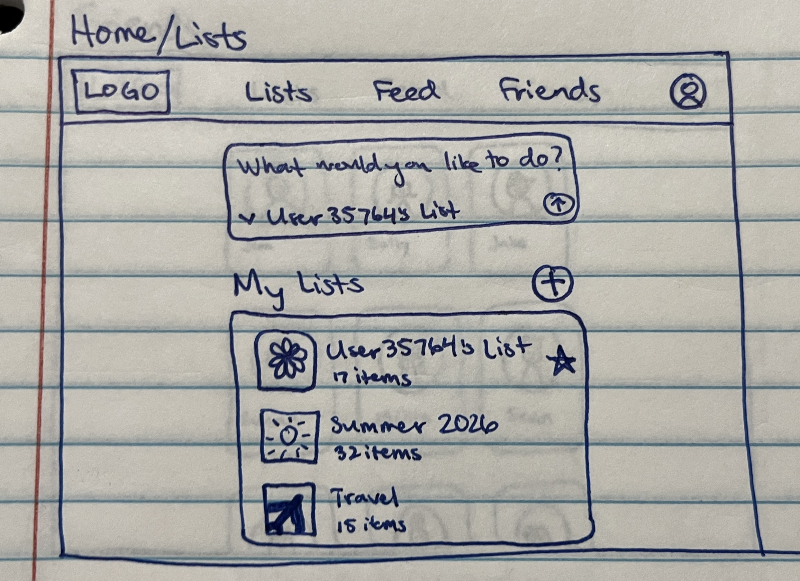
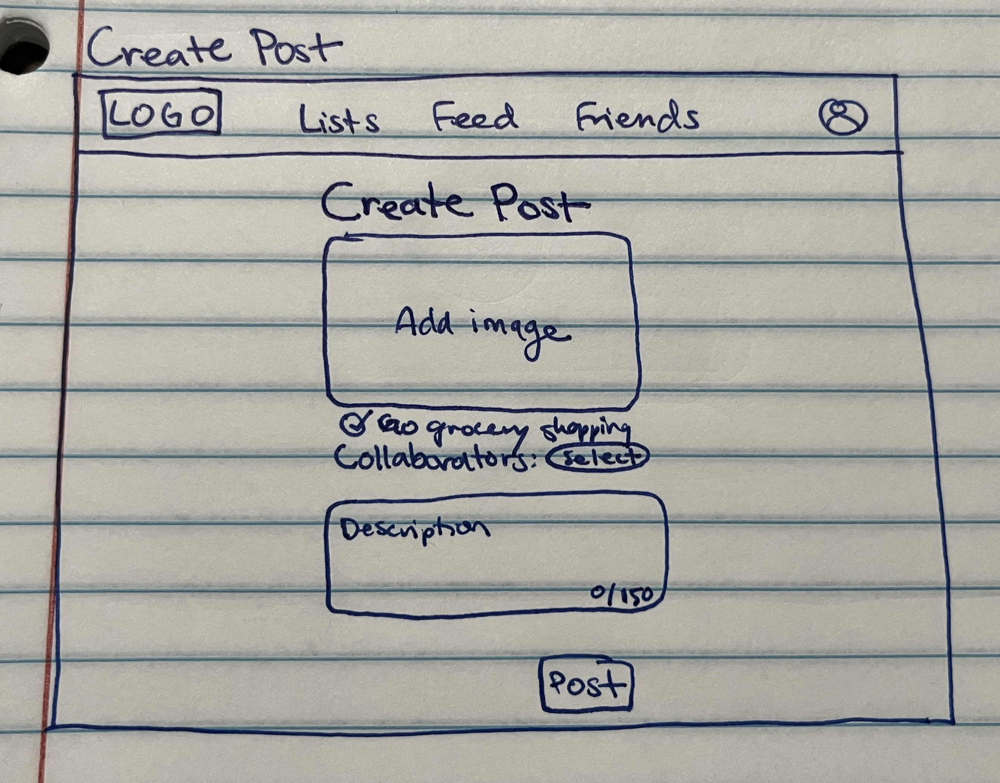
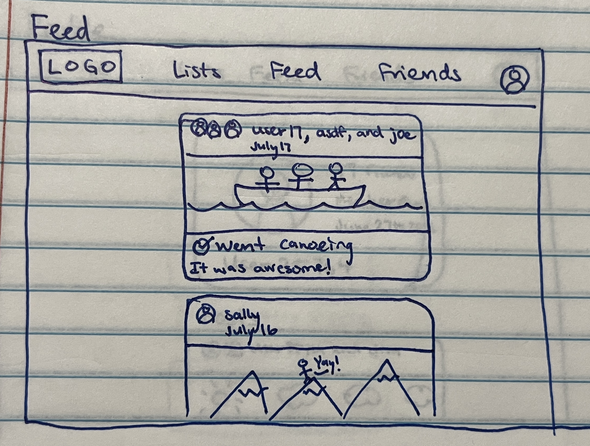
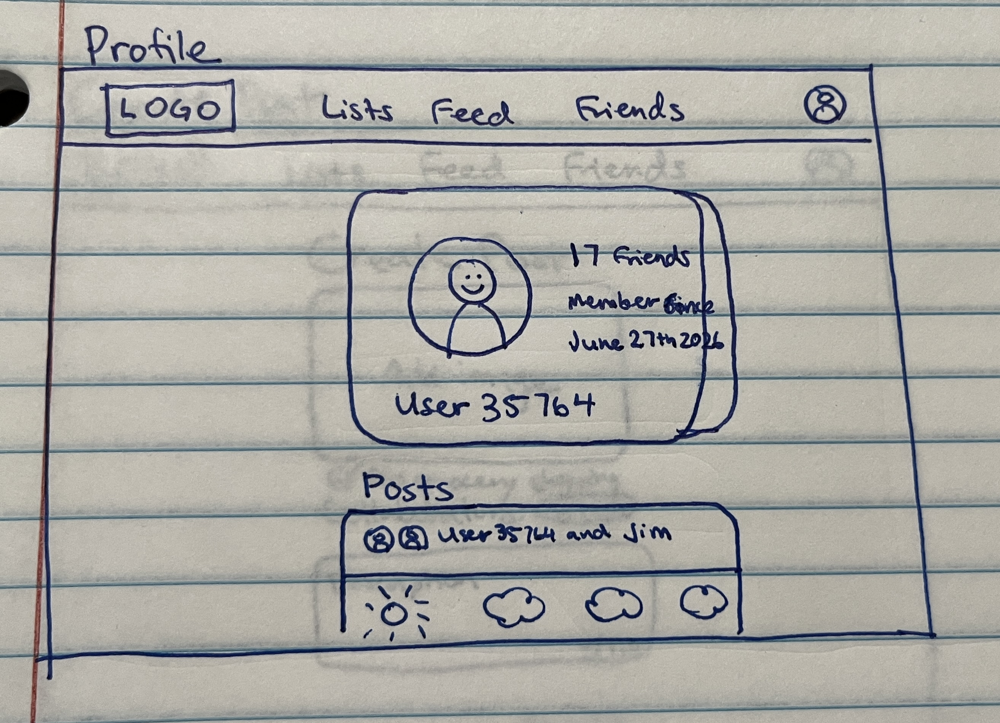
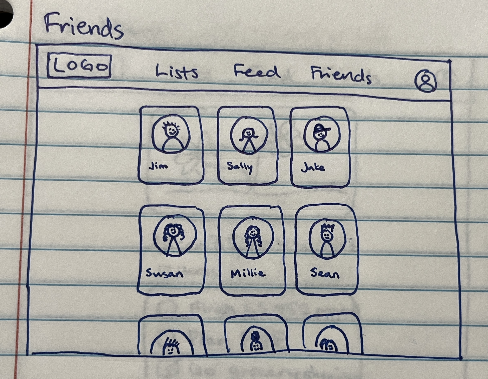
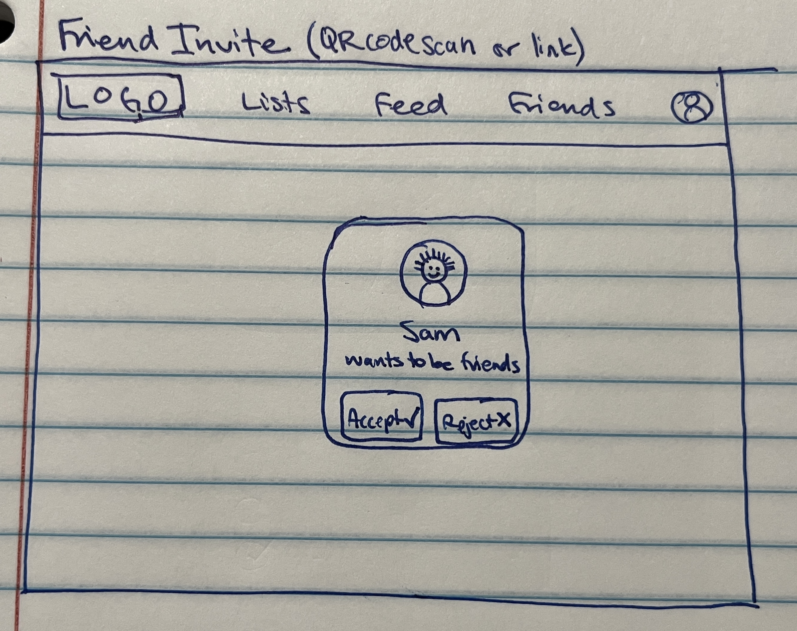
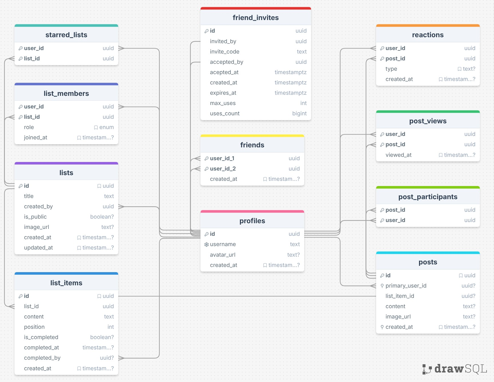
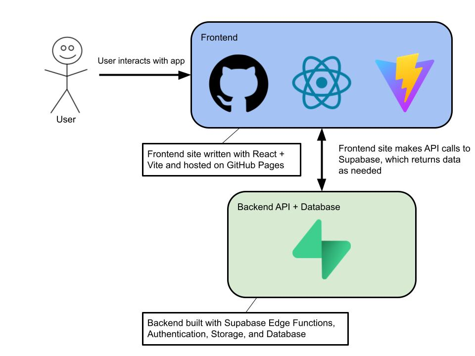

# Initial Design

## Summary & Rough UX Sketches

This app is a social media bucket list app. Users can create various lists with various items in the list. Each list has a cover picture and can be starred by a user. Users can also collaborate with friends on lists (friends can be added as collaborators at the time of the list creation or later). If needed, friends can be removed from the lists as well.

Within each list are items. Items can be completed or not completed. When a user checks off an item, they get an option to create a post. If they choose not to create a post at that time, they can return to create the post later (clicking on a completed bucket list item will either show the corresponding post with the option to delete the post (and uncheck the item) or give the option to create the post if it doesn't exist yet). Each post is simple. It includes the usernames of the author and any collaborators, the checked off item, and a picture and/or a short description (limited characters).

Each user has a feed, which contains only posts from their friends that they have not viewed yet (older posts that the user has already seen are not shown in their feed). Users can react to posts (just one type of reaction, maybe with a 🎉 reaction). If a user wants to see older posts, these are shown on each individual user's profile page (which should show all posts that the user has either authored or collaborated on). Also on the profile page are the user's profile picture, username, and date they joined the app.

Users can have friends; however, these friend invites are all mutual (both users have to be friends with each other; no following). Friend invites are sent externally using a personal invite link via text message, email, QR code scanning, or some other means. This means that (in theory) users only connect with people that they already know in real life.

One of the main points to this app is to help resolve unproductive use of social media (i.e. "doomscrolling") by helping people to complete items on their lists (users can only post if they complete an item, each post is associated with an item). The app also encourages collaboration with friends (hopefully facilitating face to face interactions) as people plan activities to do together and create posts together.

Another point is to create an app that allows people to connect in safe ways. Thus, people can't search for other users on the app, they need to send someone an invite externally to connect. In this way, cyber predators and others will have a much more difficult time connecting with children and other vulnerable parties that may be using the app.

## Initial ERD

## System Design

## Daily Goals

3/25:

- Finalize DB schema
- Set up basic project structure (frontend + Supabase)
- Implement auth (signup, login, logout)

3/26:

- Sketch out UI
- Finish initial design assignment

3/27:

- Create a list functionality
- Saving lists to DB
- User's lists displayed
- GitHub pages correctly displays site (set up with GitHub Actions)
- Items can be added or deleted from a list

3/28:

- Item completion works as intended
- Collaborators can be added and removed from a list
- Collaborators can edit list

3/30:

- Basic feed functionality
- Posts show newest first

4/1:

- Feed is filtered (only friends posts)
- Track when user has seen a post
- Seen posts are filtered out
- "You're all caught up" state if no new unseen posts

4/2:

- Create routes/pages
- Site navigation

4/3:

- Clean up UI
- Improve layout

4/4:

- Profile page
- User's posts availiable on their profile

4/6:

- Finish any UI design that is left

4/7 - 4/13 (Day to Present in Class):

- Iron out bugs
- Test with actual users (family, friends, etc.)
- Catch up from whatever I haven't finished from the other days 😅
- Get ready for presentation
